# fuxsto-design-admin-demo

[English](./README.md) · [简体中文](./README.zh-CN.md)

**A production-shaped admin template built with [fuxsto-design](https://design.fuxsto.cn).**

Vue 3.5 · TypeScript · Vite 6 · Tailwind CSS v4 — 14 pages that exercise **every one of the
library's 84 exports**, responsive down to 375px, with five static audits wired into CI.

[](./LICENSE)
[](https://vuejs.org)
[](https://vite.dev)
[](https://tailwindcss.com)
[](#component-coverage)

## Screenshots

|  |  |
| :---: | :---: |
| 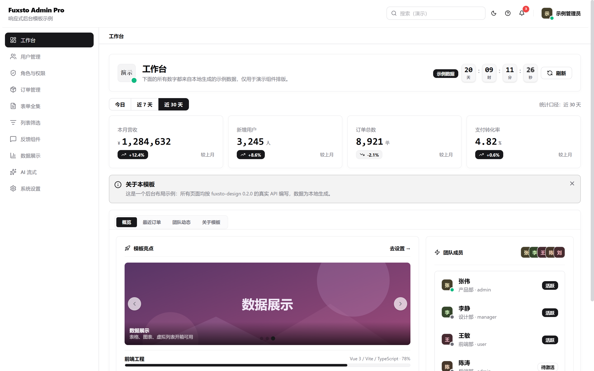<br>**Dashboard** | 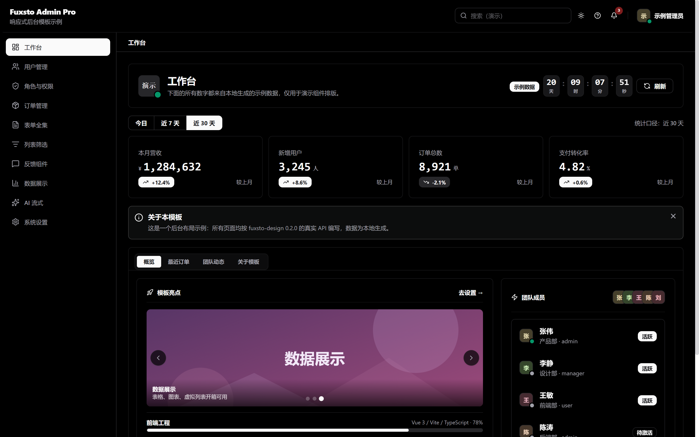<br>**Dark mode** |
| 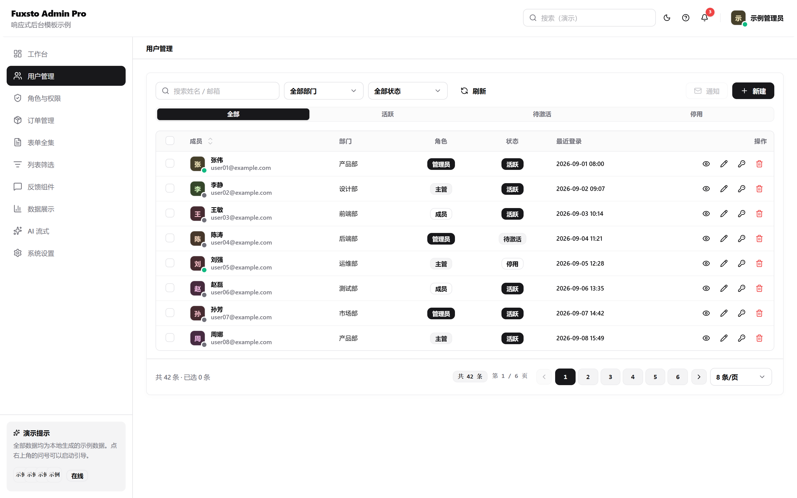<br>**Users · Table + Pagination** | 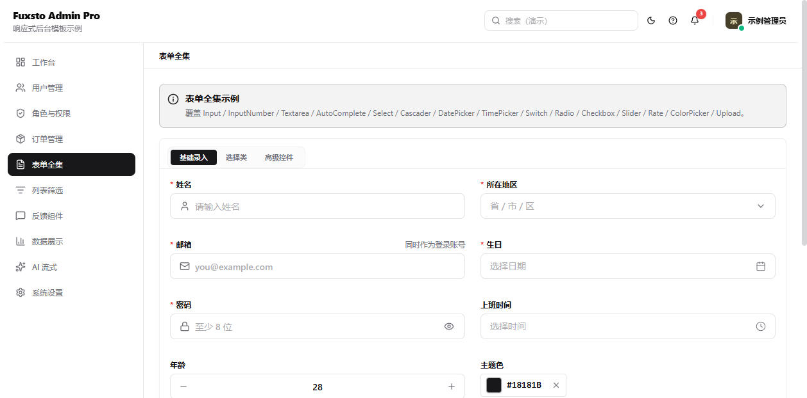<br>**Form suite** |
| 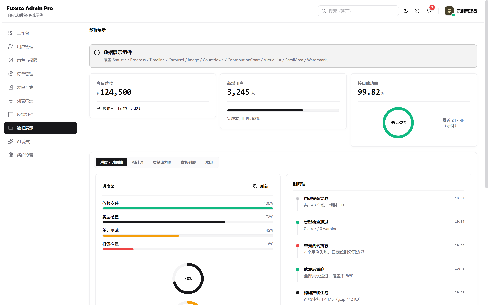<br>**Data display** | 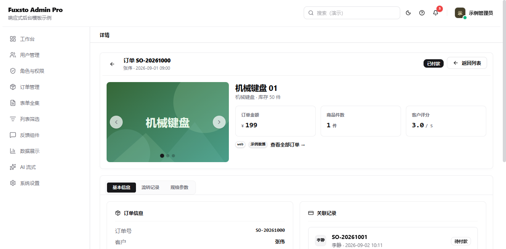<br>**Detail · Carousel + Timeline** |
| 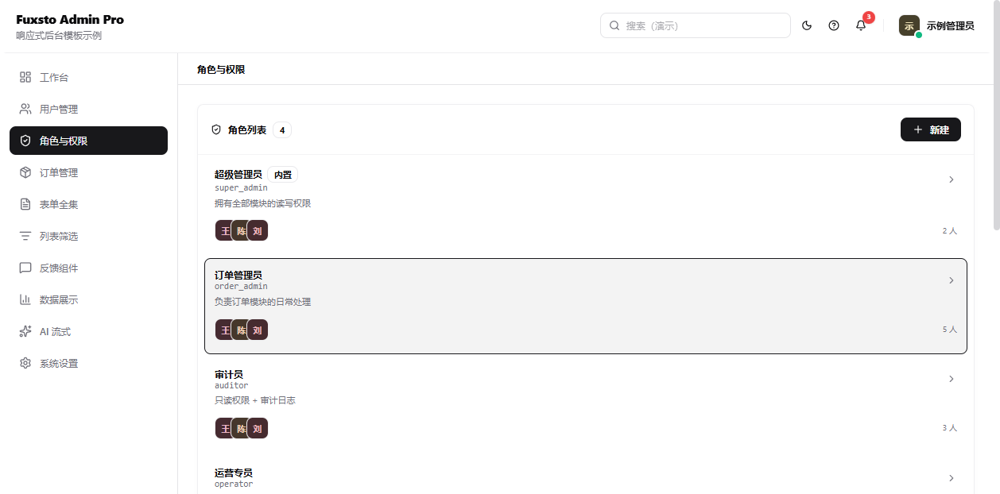<br>**Roles · Tree + Transfer** | 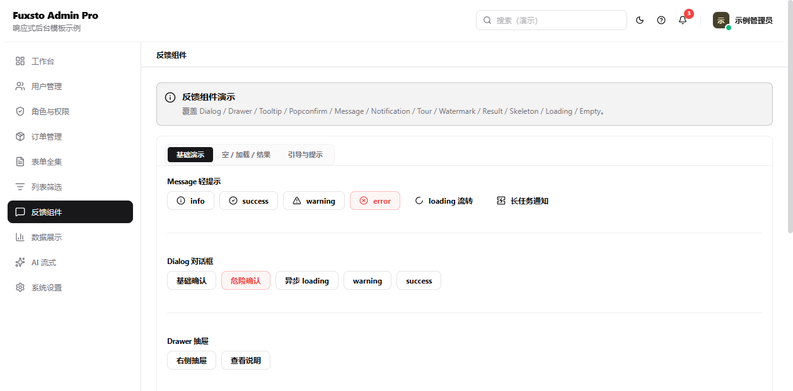<br>**Feedback suite** |
| 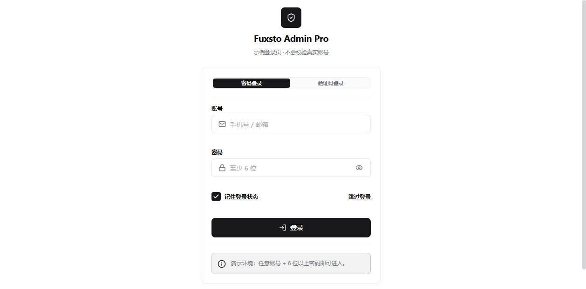<br>**Login** | 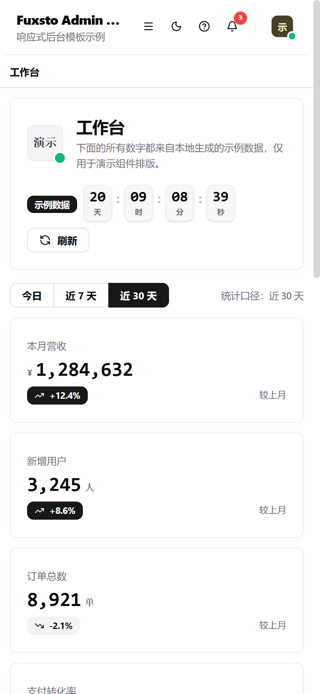<br>**Responsive · 390px** |
| 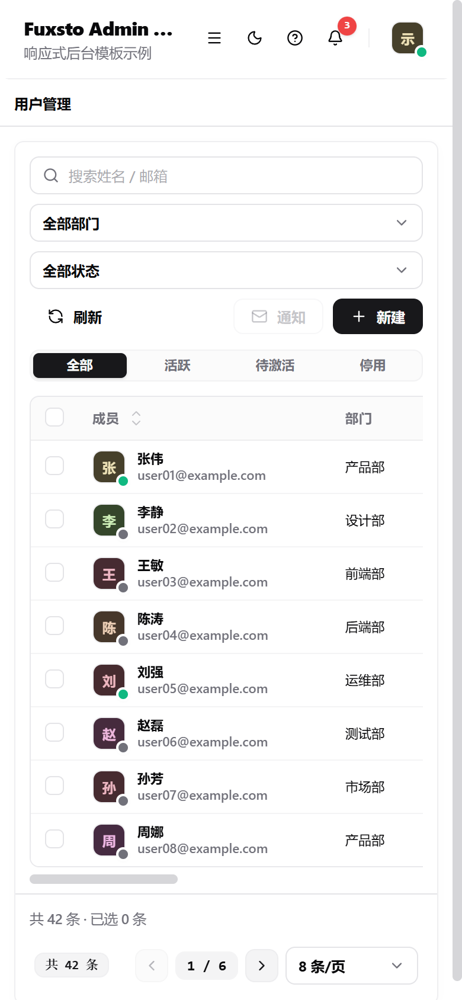<br>**Responsive tables** | *…plus List, AI streaming,<br>Settings and Profile.* |

Screenshots live in [`docs/screenshots/`](docs/screenshots) and are regenerated from the
production build — see [CONTRIBUTING.md](./CONTRIBUTING.md#regenerating-screenshots).

---

## Why this template

Most admin templates are a pile of screens that demonstrate *some* components. This one is
built the other way around: it starts from the library's export list and makes sure nothing is
left unused, then wraps it in the shape of a real product.

- **Complete library coverage** — 84/84 exports used, enforced by `scripts/coverage-audit.cjs`.
- **Real product shape** — auth, dashboard, CRUD tables, role/permission management, form suites,
  settings and profile, not just isolated demos.
- **Responsive by default** — drawer navigation, responsive grids and scrollable tables down to 375px.
- **No external assets** — placeholder imagery is generated locally as SVG data URIs, so it works offline.
- **Verification built in** — `npm run verify` fails the build on unknown props, missing coverage or
  attributes that Vue cannot inherit.
- **Light / dark theme** with a persisted preference.

## Quick start

```bash
npm install
npm run dev       # http://localhost:5173
npm run build     # production build
npm run preview   # preview the production build
```

Requires **Node >= 22.18** (see `.nvmrc`).

### Scripts

| Script | What it does |
|--------|--------------|
| `npm run dev` | Vite dev server with HMR |
| `npm run build` | Production build to `dist/` |
| `npm run preview` | Serve the production build locally |
| `npm run type-check` | `vue-tsc --noEmit` over the whole project |
| `npm run audit` | The three static audits (coverage · prop legality · attribute fallthrough) |
| `npm run verify` | `type-check` + `audit` — the gate CI runs |

## Project structure

```
src/
├── main.ts                    # entry
├── App.vue                    # <RouterView/> + <BackTop/>
├── style.css                  # @import "tailwindcss"; @import "fuxsto-design/styles"
├── router/
│   └── index.ts               # 14 page components (13 routed + 404), hash history
├── stores/
│   ├── theme.ts               # dark / light mode + localStorage
│   └── user.ts                # mock user profile
├── mock/
│   └── data.ts                # users / orders / products / org / permission
├── layouts/
│   └── MainLayout.vue         # Header + Sidebar + Breadcrumb + RouterView
├── components/
│   └── KpiCard.vue            # reusable app-level card
├── utils/
│   └── media.ts               # local SVG placeholder media (cover / avatar)
└── pages/
    ├── Login.vue              # password / code / pin
    ├── Dashboard.vue          # KPI + Tabs (overview / orders / team / release)
    ├── Users.vue              # Table + Pagination + Drawer form
    ├── Roles.vue              # Tree + Transfer
    ├── Orders.vue             # Table + KPI + Drawer
    ├── FormDemo.vue           # the full form suite
    ├── ListDemo.vue           # List + PinInput + ScrollArea
    ├── Detail.vue             # Tabs + Timeline + Image carousel
    ├── Feedback.vue           # Message / Notification / Dialog / Tour ...
    ├── DataDisplay.vue        # Statistic / Progress / Countdown / VirtualList
    ├── AIDemo.vue             # StreamingText
    ├── Settings.vue           # Anchor + ColorPicker + Switch
    ├── Profile.vue            # Avatar + Form + Upload
    └── NotFound.vue           # 404

scripts/                        # the verification scripts (see below)
docs/component-inventory.md     # inventory of the component library
```

## Pages and components used

| Page | Key components |
|------|----------------|
| **Dashboard** | Statistic · Chip · Tabs · TabViews · Carousel · Image · Alert · Progress · Timeline · Avatar · AvatarGroup · List · ListItem · Skeleton · Empty · Link · Title · Paragraph · Text · Badge |
| **Users** | Table · Pagination · Input · Select · Button · Chip · Drawer · Form · FormItem · Avatar · Switch · Popconfirm · Tooltip · Segmented · RadioGroup · Radio · Empty · Message · Dialog · Divider |
| **Roles** | Tree · Transfer · Card · List · ListItem · Avatar · AvatarGroup · Alert · Form · FormItem · Select · Drawer · Tabs · TabViews · Dialog |
| **Orders** | Table · Pagination · Statistic · Input · Select · Drawer · Segmented · Chip · Tooltip · Popconfirm · Empty · Message · Dialog · Badge · Divider |
| **FormDemo** | Form · FormItem · Input · InputNumber · Textarea · Select · AutoComplete · Cascader · DatePicker · TimePicker · Switch · RadioGroup · Radio · CheckboxGroup · Checkbox · Slider · Rate · ColorPicker · Upload · Alert |
| **ListDemo** | List · ListItem · Chip · ChipGroup · Segmented · Collapse · CollapseItem · Empty · PinInput · Input · Avatar · Badge · Skeleton · ScrollArea |
| **Detail** | Header (sticky + glass) · Tabs · TabViews · Timeline · TimelineItem · List · ListItem · Image · Carousel · Statistic · Result · Chip · Link · Title · Paragraph · Text |
| **Feedback** | Message · Notification · Dialog · Drawer · Tooltip · Popconfirm · Alert · Result · Skeleton · Loading · Empty · Tour · Watermark |
| **DataDisplay** | Statistic · Progress · Timeline · Carousel · Image · Countdown · ContributionChart · VirtualList · ScrollArea |
| **AI** | StreamingText (sequence / random / static / chat) |
| **Settings** | Anchor · Switch · Segmented · ColorPicker · Slider · Select · RadioGroup · Radio · Input · Alert · Notification |
| **Profile** | Avatar · Card · Form · FormItem · Input · Upload · Switch · Divider · Statistic · Chip |

Plus the app shell used by `MainLayout.vue`:
Header · Breadcrumb · BreadcrumbItem · Menu · Tooltip · Avatar · Badge · Divider · Watermark · Tour (`startTour`).

## Component coverage

The library exports **84** tracked tokens (73 SFCs, 3 imperative APIs — `Message`,
`Notification`, `Dialog` — the `cn` utility, and the `Tag` / `TagGroup` aliases).

> **84 / 84 used · 0 missing**

Run `npm run audit` at any time to re-check. Adding a page that stops using a component will
make that audit fail — deliberately.

## Verification

Five gates, all green on every commit:

```bash
npm run verify   # type-check + all three static audits
npm run build
```

| Gate | Script | Checks |
|------|--------|--------|
| Type safety | `npm run type-check` | `vue-tsc --noEmit` — 0 errors |
| Build | `npm run build` | production build succeeds |
| Component coverage | `scripts/coverage-audit.cjs` | every exported component is actually used (84/84) |
| Prop legality | `scripts/prop-legality-audit.cjs` | no unknown props vs. the installed `.d.ts` baseline |
| Attribute fallthrough | `scripts/fallthrough-audit.cjs` | no `class` / `style` / undeclared attr on **Fragment-root** components |

`fallthrough-audit.cjs` derives the Fragment-root set by statically scanning the library's
compiled output for `return openBlock(), createElementBlock(Fragment, ...)`, so it stays correct
across `fuxsto-design` version bumps instead of relying on a hard-coded list.

## fuxsto-design notes (gotchas worth knowing)

Things that are easy to get wrong — each was hit and fixed while building this template.

- **Fragment-root components cannot take `class` / `style`.**
  `Image`, `Table`, `Pagination` and `Slider` render a **Fragment** root (e.g. `Image` renders a
  `<div>` plus a preview `<Teleport>`). Vue 3 cannot auto-inherit non-prop attributes onto a
  Fragment, so it logs
  `[Vue warn]: Extraneous non-props attributes (class) ... renders fragment`
  and **silently drops the attribute** — the classic symptom is a collapsed image that looks
  like "the component has no picture in it".
  Size `Image` with props instead: `<Image src="…" fit="cover" width="100%" height="100%" />`.
- **Every `Carousel` slide must be a plain element.**
  `Carousel` writes the page width/height as an inline `style` onto each slide's **root node**,
  so wrap each slide in a plain element (e.g. `<div class="h-full w-full">`) and let the inner
  component fill it. Don't make `<Image>` a direct child of `Carousel`, and don't use `v-for`
  inside the default slot — it compiles to a single Fragment and the carousel treats it as one page.
- **Local SVG media must use `rgb()`.** SVG loaded via `` does not reliably honour the
  space-separated `hsl(H S% L%)` colour syntax and renders blank. `src/utils/media.ts` emits
  `rgb(r, g, b)` plus explicit `width`/`height` for exactly this reason.
- **`Tabs` / `TabViews`** take `:options="[{ label, value }]"`, not `<Tabs.Item>`.
  `TabViews` uses named slots keyed by `value` (e.g. `<template #basic>`).
- **`StreamingText`** props are `texts` and `currentIndex` (not `textList` / `index`).
- **`Header`** default slot is the right-hand action area — there is no `actions` slot.
- **`Menu`** `options` is a 2-D array (groups); `@select` emits the full `MenuItem`.
- **`Tooltip` / `Popconfirm`** wrap a single trigger element.
- **Tailwind v4 + Vite**: the v4 scanner does not always pick up `.vue` files reached through
  `() => import(...)` in a router config. Add `@source "../**/*.{vue,ts,tsx,js,jsx}"` to your CSS
  entry to force the scan.

## Customising

1. Start at `src/router/index.ts` to understand the route → page mapping.
2. Each page keeps its demo state in `<script setup>`; the `<template>` is layout only.
3. `src/stores/theme.ts` persists the light/dark preference to `localStorage`.
4. To move off mock data, replace the imports from `@/mock/data` with your own fetcher.
   Keep the component APIs as they are — the audits will tell you if a prop goes out of contract.

## Contributing

Please read [CONTRIBUTING.md](./CONTRIBUTING.md) — it documents the hard rules above and the
five gates your PR must pass. Bug reports and feature requests use the
[issue templates](.github/ISSUE_TEMPLATE). Security issues: see [SECURITY.md](./SECURITY.md).

This project follows the [Contributor Covenant](./CODE_OF_CONDUCT.md).

## License

[MIT](./LICENSE) © fuxsto

## Acknowledgements

- [fuxsto-design](https://design.fuxsto.cn) — the component library this template is built on.
- [Vue](https://vuejs.org) · [Vite](https://vite.dev) · [Tailwind CSS](https://tailwindcss.com)
- [lucide-vue-next](https://lucide.dev) — icons.
